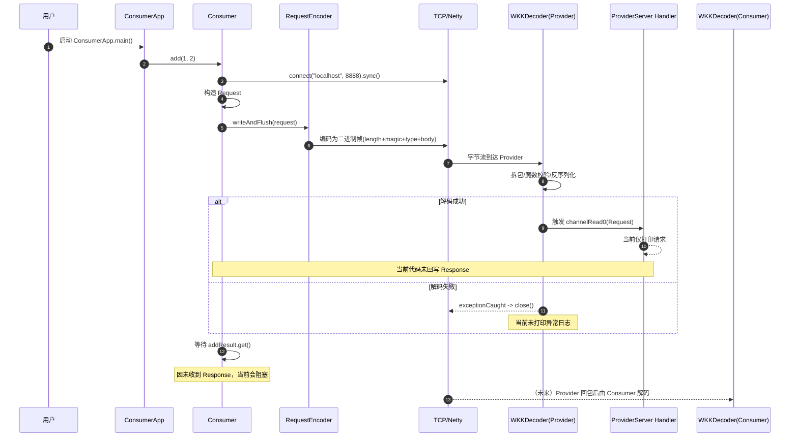

# wkk-rpc

一个基于 Netty 的轻量级 RPC 学习项目，当前实现了自定义协议、请求/响应编解码，以及最小可运行的 Provider/Consumer 启动入口。

## 当前进展

- 已完成基础协议模型：
  - `Message`：定义魔数与消息类型（`REQUEST` / `RESPONSE`）
  - `Request`：服务名、方法名、参数类型、参数值
  - `Response`：返回值
- 已完成编解码组件：
  - `RequestEncoder`：将 `Request` 编码为二进制协议帧
  - `ResponseEncoder`：将 `Response` 编码为二进制协议帧
  - `WKKDecoder`：基于长度字段拆包并反序列化请求/响应
- 已完成启动入口：
  - Provider 端：`ProviderApp` -> `ProviderServer`
  - Consumer 端：`ConsumerApp` -> `Consumer`
- 已打通最小调用链路骨架：
  - Consumer 连接 `localhost:8888` 并发送 `Request`
  - Provider 端具备接收 `Request` 的处理器

## 项目结构

```text
src/main/java/com/wkk/insight/rpc
├── consumer
│   ├── Consumer.java
│   └── ConsumerApp.java
├── core
│   ├── RequestEncoder.java
│   ├── ResponseEncoder.java
│   └── WKKDecoder.java
├── protocol
│   ├── Message.java
│   ├── Request.java
│   └── Response.java
└── provider
    ├── ProviderApp.java
    └── ProviderServer.java
```

## Netty 基础速览（结合本项目）

这部分用于快速解释：为什么 `ProviderServer` 和 `Consumer` 要这么写。

### 1) Reactor 线程模型与 `EventLoopGroup`

- Netty 采用事件驱动模型，IO 事件（连接、读、写）由 `EventLoop` 线程处理。
- Provider 端通常分两组线程：
  - `bossGroup`：负责接收连接（accept）
  - `workerGroup`：负责处理已连接通道上的读写事件
- 这就是 `ProviderServer` 中 `group(bossGroup, workerGroup)` 的原因。
- Consumer 端只需要主动发起连接与读写，一般一组 `EventLoopGroup` 即可。

### 2) `ServerBootstrap` vs `Bootstrap`

- `ServerBootstrap`：服务端启动器，用于监听端口并接收新连接。
- `Bootstrap`：客户端启动器，用于连接远程地址。
- 所以本项目中：
  - Provider 使用 `ServerBootstrap` + `NioServerSocketChannel`
  - Consumer 使用 `Bootstrap` + `NioSocketChannel`

### 3) `Channel` 与 `ChannelPipeline`

- `Channel` 可以理解为一个连接。
- 每个 `Channel` 绑定一条 `Pipeline`（责任链），数据进来/出去都会经过它。
- 本项目的典型链路：
  - 入站（inbound）：`WKKDecoder` -> 业务处理器 `SimpleChannelInboundHandler<...>`
  - 出站（outbound）：`RequestEncoder` 或 `ResponseEncoder`

### 4) 为什么要“先解码再业务处理”

- TCP 是字节流，可能出现半包/粘包，不能直接把收到的数据当成完整对象。
- `WKKDecoder` 基于长度字段先切出完整帧，再做魔数校验、消息类型判断和 JSON 反序列化。
- 只有解码成功，业务处理器才会触发 `channelRead0`。
- 所以你看到“Provider 没打印”的常见原因之一就是：数据在解码阶段失败，未进入业务处理器。

### 5) `sync()` / `get()` 为什么会阻塞

- `connect(...).sync()`：等待连接建立完成。
- `bind(...).sync()`：等待端口绑定完成。
- `CompletableFuture#get()`：等待异步结果完成。
- 本项目中 Consumer 的 `addResult.get()` 会等待 Provider 回包；如果 Provider 不回 `Response`，这里会一直阻塞。

### 6) `ChannelFuture` 的意义

- Netty IO 操作默认异步（如 connect/write/bind）。
- `ChannelFuture` 用来拿到异步结果、监听是否成功、串联后续动作。
- 当前写法里 `writeAndFlush(request)` 发送请求后没有显式失败处理，后续可加监听器提升可观测性。

### 7) 入站/出站处理器放置顺序

- Pipeline 中处理器顺序会影响事件流向与匹配。
- 实战建议：
  - 入站解码器放前面（先把字节解成对象）
  - 业务处理器放后面（只处理业务对象）
  - 出站编码器保证在写出路径可被命中
- 本项目当前顺序已体现这个思路，是后续扩展（鉴权、压缩、心跳）的基础。

## 协议说明（当前实现）

当前网络帧格式如下：

1. `length`（4 字节，int）
2. `logic`（魔数，来自 `Message.MESSAGE_LOGIC`）
3. `type`（1 字节：请求/响应）
4. `body`（JSON 序列化后的请求或响应）

`WKKDecoder` 使用 `LengthFieldBasedFrameDecoder` 做半包/粘包处理，然后校验魔数并按类型反序列化。

## 运行方式

> 环境要求：JDK 17，Maven 3.x（或使用 IDE 的 Maven 支持）

### 1) 启动 Provider

运行 `com.wkk.insight.rpc.provider.ProviderApp`。

### 2) 启动 Consumer

运行 `com.wkk.insight.rpc.consumer.ConsumerApp`。

默认会连接 `localhost:8888` 并发起一次 `add(1, 2)` 请求。

## 一次调用的时序图（当前实现）



> 备注：上图刻意保留了“当前未完成回包”的事实，便于和现有代码行为对齐。

## 当前已知问题

基于当前代码，存在以下行为是“预期中的未完成状态”：

- Provider 端收到请求后只打印，不回包，Consumer 会阻塞在 `addResult.get()`。
- `WKKDecoder.exceptionCaught` 中仅关闭连接，未打印异常，调试时会出现“看起来没有任何输出”。
- `Request.parameterTypes` 使用 `Class<?>[]`，在 JSON 序列化/反序列化场景下可能带来兼容性问题（后续可改为字符串类型名）。
- 目前未接入真实服务注册、方法反射调用和返回值封装（仍处于骨架阶段）。

## 下一步建议

- 在 `ProviderServer` 的请求处理器中执行真实方法调用，并构造 `Response` 回写。
- 完善异常日志与可观测性（特别是解码失败、连接失败、序列化失败）。
- 将参数类型从 `Class<?>[]` 改为可序列化的类型描述（如 `String[]`）。
- 补充超时控制与线程资源释放（Consumer 侧 `EventLoopGroup` 生命周期）。
- 增加基础集成测试（Provider + Consumer 端到端验证）。

## 依赖

核心依赖如下（详见 `pom.xml`）：

- Netty (`io.netty:netty-all`)
- Fastjson2 (`com.alibaba.fastjson2:fastjson2`)
- Lombok (`org.projectlombok:lombok`)
- Hessian（已引入，当前核心链路未使用）
- Curator Discovery（已引入，当前核心链路未使用）

## 说明

当前仓库主要用于 RPC 通信链路与协议演进验证。随着后续迭代，README 会同步更新完整时序图、配置项和测试说明。
