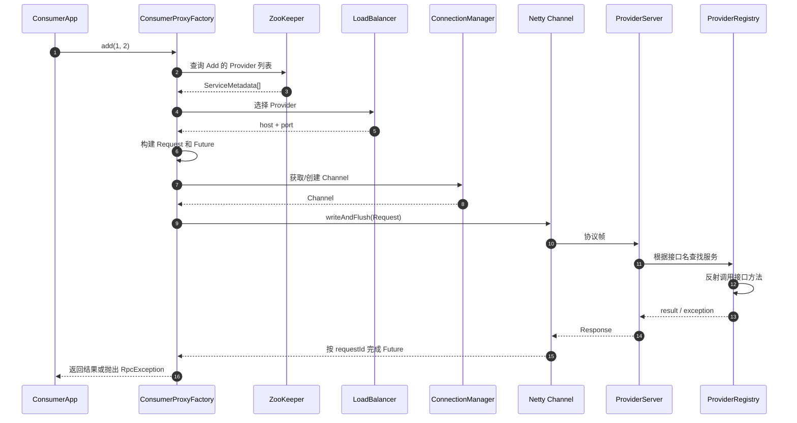
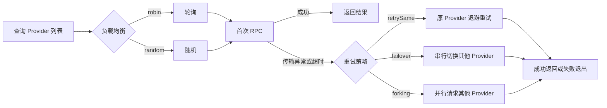

# wkk-rpc

`wkk-rpc` 是一个基于 Netty 和 ZooKeeper 的轻量级 RPC 学习项目。当前已打通“服务注册与发现 → 动态代理 → 负载均衡 → Netty 通信 → 反射调用 → 结果回传”的完整链路，并实现了请求超时和三种重试策略。

## 已实现能力

- 自定义 TCP 协议，支持长度字段拆包、魔数校验和请求/响应类型识别。
- Fastjson2 请求与响应序列化。
- Provider 本地服务注册和基于接口的反射调用。
- ZooKeeper/Curator 服务注册与发现，以及注册中心查询异常时的本地缓存回退。
- JDK 动态代理生成 Consumer 调用端。
- 基于 `requestId` 和 `CompletableFuture` 的并发请求/响应关联。
- Provider 连接复用和断开后的连接缓存清理。
- `robin` 和 `random` 两种负载均衡策略。
- `retrySame`、`failover` 和 `forking` 三种重试策略。
- 单次请求超时和重试阶段总时间预算。

## 项目结构

```text
src/main/java/com/wkk/insight/rpc
├── api                 # RPC 服务接口示例
├── consumer
│   ├── ConsumerApp.java
│   ├── ConsumerProperties.java
│   ├── ConsumerProxyFactory.java
│   └── ConnectionManager.java
├── core
│   ├── RequestEncoder.java
│   ├── ResponseEncoder.java
│   └── WKKDecoder.java
├── loadbalance        # 轮询/随机负载均衡
├── protocol           # Message / Request / Response
├── provider
│   ├── ProviderApp.java
│   ├── ProviderServer.java
│   └── ProviderRegistry.java
├── register           # ZooKeeper 注册发现与本地缓存装饰器
└── retry              # RetrySame / Failover / Forking
```

`consumer/Consumer.java` 是早期占位实现，当前主调用链路使用 `ConsumerProxyFactory`。`RedisServiceRegister` 仅保留了扩展骨架，尚未实现。

## 核心调用链路


```mermaid
sequenceDiagram
    autonumber
    participant App as ConsumerApp
    participant Proxy as ConsumerProxyFactory
    participant Registry as ZooKeeper
    participant LB as LoadBalancer
    participant Conn as ConnectionManager
    participant Netty as Netty Channel
    participant Provider as ProviderServer
    participant Local as ProviderRegistry

    App->>Proxy: add(1, 2)
    Proxy->>Registry: 查询 Add 的 Provider 列表
    Registry-->>Proxy: ServiceMetadata[]
    Proxy->>LB: 选择 Provider
    LB-->>Proxy: host + port
    Proxy->>Proxy: 构建 Request 和 Future
    Proxy->>Conn: 获取/创建 Channel
    Conn-->>Proxy: Channel
    Proxy->>Netty: writeAndFlush(Request)
    Netty->>Provider: 协议帧
    Provider->>Local: 根据接口名查找服务
    Local->>Local: 反射调用接口方法
    Local-->>Provider: result / exception
    Provider-->>Netty: Response
    Netty-->>Proxy: 按 requestId 完成 Future
    Proxy-->>App: 返回结果或抛出 RpcException
```

Provider 只会调用已通过接口注册的方法。`ProviderRegistry` 使用接口类查找 `Method`，避免远程调用实现类上未暴露的方法。

## 网络协议

一个协议帧的格式为：

```text
+-----------------+---------------------+---------------+------------------+
| length (4 bytes)| magic (UTF-8 bytes) | type (1 byte) | JSON body        |
+-----------------+---------------------+---------------+------------------+
```

- `length`：不包含自身 4 字节，值为 `magic + type + body` 的总长度。
- `magic`：`Message.MESSAGE_LOGIC`，当前为字符串 `无牙仔` 的 UTF-8 字节。
- `type`：`1` 表示 `REQUEST`，`2` 表示 `RESPONSE`。
- `body`：Fastjson2 序列化的 `Request` 或 `Response`。

`WKKDecoder` 基于 `LengthFieldBasedFrameDecoder` 处理 TCP 粘包/半包，最大帧长度为 1 MiB。解码器先校验魔数，再根据消息类型反序列化。

### 请求与响应关联

`Request` 通过 JVM 内共享的 `AtomicInteger` 生成 `requestId`。Consumer 发送前将 `requestId -> CompletableFuture<Response>` 放入 `inFlightRequests`，收到响应后再根据同一 ID 完成对应 Future。

## 服务注册与发现

Provider 启动流程：

1. 使用 `ProviderRegistry.register()` 绑定接口和服务实例。
2. Netty 端口绑定成功。
3. 为每个本地服务构建 `ServiceMetadata`。
4. 通过 Curator Service Discovery 注册到 ZooKeeper 的 `/wkk/rpc` 路径下。

Consumer 每次方法调用前都会查询 Provider 列表。`DefaultServiceRegister` 是一个装饰器：注册中心查询成功时更新本地缓存；查询抛出异常时返回最后一份缓存。如果从未成功查询过，则返回空列表。

| `registerType` | 状态 |
| --- | --- |
| `zookeeper` | 已实现，当前启动示例使用该模式 |
| `redis` | 仅骨架，`init()` 和 `registerService()` 会抛出 `UnsupportedOperationException` |

## Consumer 配置

```java
RegisterConfig registry = new RegisterConfig();
registry.setRegisterType("zookeeper");
registry.setConnectString("127.0.0.1:2181");

ConsumerProperties properties = new ConsumerProperties();
properties.setRegistryConfig(registry);
properties.setLoadBalancePolicy("robin");
properties.setRetryPolicy("retrySame");
properties.setConnectTimeoutMs(3_000);
properties.setRequestTimeoutMs(3_000);
properties.setMethodTimeoutMs(30_000);
```

| 配置项 | 默认值 | 作用 |
| --- | --- | --- |
| `workThreadNum` | `4` | Consumer Netty EventLoop 线程数 |
| `connectTimeoutMs` | `3000` | Provider TCP 连接超时 |
| `requestTimeoutMs` | `3000` | 每次 RPC 尝试的最大等待时间 |
| `methodTimeoutMs` | `30000` | 进入重试策略后的总时间预算 |
| `loadBalancePolicy` | `robin` | 负载均衡策略 |
| `retryPolicy` | `retrySame` | 重试策略 |
| `registryConfig` | 空配置对象 | 注册中心类型与连接地址 |

## 负载均衡

| 配置值 | 实现 | 行为 |
| --- | --- | --- |
| `robin` | `RoundRobinLoadBalancer` | 使用原子序号轮流选择 Provider，并用 `Math.floorMod` 处理序号溢出 |
| `random` | `RandomLoadBalancer` | 使用 `ThreadLocalRandom` 随机选择 Provider |

负载均衡用于选择首次 RPC 的 Provider。`failover` 策略也会使用同一负载均衡器从剩余节点中选择下一个 Provider。候选列表为空时会抛出 `RpcException`。

## 超时与重试

### 超时语义

- `requestTimeoutMs` 是单次请求超时。Consumer 通过 `HashedWheelTimer` 使 Future 异常完成，并从 `inFlightRequests` 中清理请求。
- `methodTimeoutMs` 是重试阶段的总预算，不包含首次 RPC。按当前实现，一次代理调用的最长耗时约为 `requestTimeoutMs + methodTimeoutMs`。
- 客户端超时只会停止等待，无法中断 Provider 上已经开始的业务。迟到响应可能触发 `request Id... 找不到` 日志。
- 当前重试只由连接、发送或等待结果期间的异常触发。已正常收到但 `code != 200` 的业务响应不会重试。

### 重试策略

| 配置值 | 实现 | 行为 | 适用场景与风险 |
| --- | --- | --- | --- |
| `retrySame` | `RetrySame` | 沿用首次失败的 Provider；使用带随机抖动的指数退避，最多重试 3 次 | 适合瞬时网络抖动；Provider 持续故障时收益较低 |
| `failover` | `FailoverRetryPolicy` | 排除首次失败的 Provider，按负载均衡结果串行尝试每个剩余节点 | 适合单节点故障；可能增加尾延迟 |
| `forking` | `ForkingRetryPolicy` | 并行请求所有其他 Provider，返回第一个正常完成的 Future | 适合对尾延迟敏感的幂等读操作；会放大请求量 |

`retrySame` 的退避大致为 100–199 ms、200–299 ms 和 400–499 ms，单次退避上限为 1 秒。`forking` 不会取消已发送的其他请求；写操作使用任何重试策略前都应引入业务幂等键。


```mermaid
flowchart LR
    A["查询 Provider 列表"] --> B{"负载均衡"}
    B -->|"robin"| C["轮询"]
    B -->|"random"| D["随机"]
    C --> E["首次 RPC"]
    D --> E
    E -->|"成功"| F["返回结果"]
    E -->|"传输异常或超时"| G{"重试策略"}
    G -->|"retrySame"| H["原 Provider 退避重试"]
    G -->|"failover"| I["串行切换其他 Provider"]
    G -->|"forking"| J["并行请求其他 Provider"]
    H --> K["成功返回或失败退出"]
    I --> K
    J --> K
```

## 运行示例

### 1. 环境要求

- JDK 17+
- Maven 3.x（也可使用 IntelliJ IDEA 内置 Maven）
- 本地 ZooKeeper，默认连接地址为 `127.0.0.1:2181`

### 2. 启动 Provider

运行 `com.wkk.insight.rpc.provider.ProviderApp`。示例会在同一 JVM 中启动两个 Provider：

| 端口 | 服务实现 | 用途 |
| --- | --- | --- |
| `8887` | `AddImpl` | 立即返回 `a + b` |
| `8888` | `AddTimeountImpl` | 延迟约 3 秒返回，用于观察超时和重试 |

### 3. 启动 Consumer

运行 `com.wkk.insight.rpc.consumer.ConsumerApp`。Consumer 会创建 `Add` 接口的动态代理并连续调用两次 `add(1, 2)`。Provider 列表的返回顺序由注册中心决定，不应依赖某次调用固定落到某个端口。

## 当前限制与后续方向

- Provider 直接在 Netty worker EventLoop 中执行业务方法；阻塞业务会占用 IO 线程，应拆分业务线程池。
- Consumer 暂无统一的 `close()` 生命周期，Netty EventLoop、`HashedWheelTimer` 和注册中心客户端没有显式释放。
- `methodTimeoutMs` 目前只覆盖重试阶段，而非整个代理方法调用。
- 请求超时后不会向 Provider 发送取消信号，迟到响应只能在 Consumer 端忽略。
- `forking` 以 Future 是否异常完成判断成功；正常返回的业务错误响应仍可能成为第一个结果。
- `Request.parameterTypes` 传输 `Class<?>[]`，解码时开启了 `SupportClassForName`；跨版本兼容性和反序列化安全性仍需完善。
- `requestId` 只保证单 JVM 进程内的递增，整型回绕和跨进程唯一性尚未处理。
- Redis 注册中心、心跳/健康检查、熔断、限流、鉴权和协议版本协商尚未实现。
- `src/test` 主要是早期 BIO 示例，尚缺少针对当前 Netty RPC 链路的自动化单元和集成测试。

## 依赖

- Netty：网络通信、协议编解码和定时器。
- Fastjson2：请求/响应 JSON 序列化。
- Curator Discovery：ZooKeeper 服务注册与发现。
- Guava：当前代码中的集合工具依赖，由 Curator 传递引入。
- Lombok：数据类和日志样板代码生成。
- Logback/SLF4J：日志输出。
- Hessian：已引入，当前主 RPC 链路未使用。

## 构建验证

```bash
mvn -DskipTests compile
```

当前没有可执行的自动化测试用例，`mvn test` 主要用于验证测试源码能否编译。
